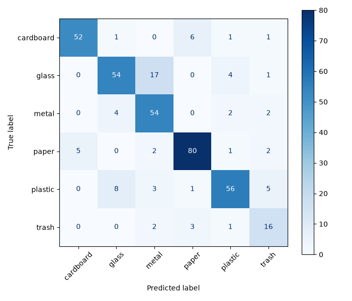
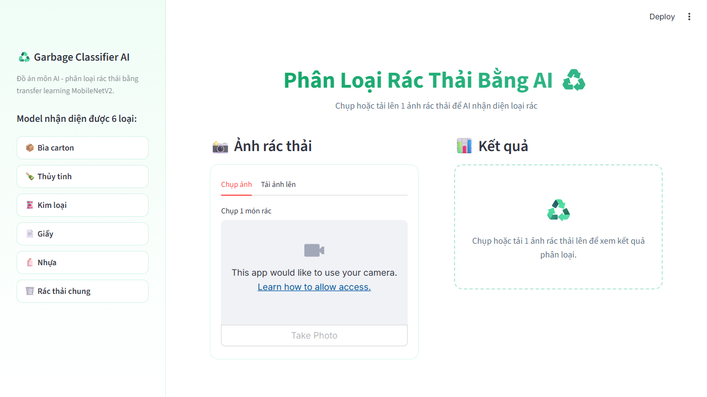

# Báo cáo đồ án: Phân loại rác thải bằng AI

Nhóm 1, UTH - Nguyễn Lê Gia Bảo, Nguyễn Minh Chung, Nguyễn Tấn Phát, Trần Hữu Tài,
Vi Đức Thành Đạt

> Đây là khung báo cáo, mỗi phần ghi rõ người phụ trách. Các phần đánh dấu `[TODO]` cần
> điền thêm bằng lời của chính người phụ trách trước khi nộp - đây là phần thể hiện các
> bạn thật sự hiểu những gì mình đã làm.

## 1. Giới thiệu bài toán

*(Cả nhóm)*

Rác thải sinh hoạt cần được phân loại đúng trước khi bỏ vào thùng để tái chế hiệu quả,
nhưng nhiều người không nắm rõ một món rác thuộc nhóm nào. Đồ án xây dựng một công cụ nhận
diện loại rác qua ảnh chụp, giúp người dùng biết cách xử lý đúng ngay lập tức.

- **Input:** 1 ảnh chụp hoặc tải lên (JPG/PNG/JPEG) chứa 1 món rác.
- **Output:** 1 trong 6 nhãn (bìa carton, thủy tinh, kim loại, giấy, nhựa, rác thải chung),
  kèm độ tin cậy (%) và gợi ý cách xử lý cụ thể cho loại đó.
- **Đối tượng sử dụng:** người dùng phổ thông không rành về phân loại rác tái chế.

## 2. Dữ liệu

*(Người 1)*

- **Nguồn:** dataset `asdasdasasdas/garbage-classification` trên Kaggle, tải tự động qua
  `kagglehub` (`src/data_processing.py`, hàm `download_dataset()`).
- **Số lượng:** 2.528 ảnh, chia đều theo 6 lớp (cardboard, glass, metal, paper, plastic,
  trash).
- **Chia tập:** 70% train / 15% val / 15% test, chia riêng theo từng lớp để tỷ lệ 6 lớp
  đồng đều ở cả 3 tập (`split_dataset()`).
- **Augmentation:** xoay nhẹ, dịch chuyển, lật ngang, zoom - nằm trong `model.py` dưới dạng
  layer Keras (`RandomRotation`, `RandomTranslation`, `RandomFlip`, `RandomZoom`), không
  nằm ở bước xử lý dữ liệu, nên tự động tắt khi model dự đoán thật.

[TODO: chèn ảnh minh họa 1 ảnh gốc và ảnh sau augmentation - chạy `python src/train.py`,
lấy 1 batch từ `train_ds` để xem]

## 3. Phương pháp, mô hình AI

*(Người 2, phần công thức f(x) của kiến trúc model)*

Bài toán là phân loại ảnh đa lớp (multi-class classification): cho ảnh đầu vào x, dự đoán
nhãn y ∈ {cardboard, glass, metal, paper, plastic, trash}.

Nhóm chọn **transfer learning với MobileNetV2** thay vì tự huấn luyện CNN từ đầu, vì dataset
chỉ có ~2.500 ảnh - không đủ để tự học đặc trưng ảnh từ số 0, trong khi MobileNetV2 đã học
sẵn đặc trưng thị giác từ ImageNet (1.4 triệu ảnh) và có kích thước nhẹ, phù hợp thời gian
huấn luyện ngắn.

Kiến trúc model f(x), theo đúng thứ tự trong `model.py` hàm `build_model()`:

1. Augmentation (chỉ lúc train): xoay, dịch, lật, zoom ngẫu nhiên.
2. `preprocess_input`: scale pixel từ [0, 255] về [-1, 1] theo đúng chuẩn MobileNetV2.
3. MobileNetV2 (đóng băng, `weights="imagenet"`, `include_top=False`) - trích đặc trưng.
4. `GlobalAveragePooling2D` - gộp đặc trưng không gian thành 1 vector.
5. `Dropout(0.2)` - giảm overfitting.
6. `Dense(6, activation="softmax")` - ra xác suất 6 lớp.

## 4. Huấn luyện

*(Người 2, dựa trên `../CODE/src/train.py`)*

- **Baseline:** 15 epoch, optimizer Adam, loss `categorical_crossentropy`, `class_weight`
  tính theo `compute_class_weight("balanced", ...)` để lớp ít ảnh không bị model bỏ quên.
  Callback `ModelCheckpoint` (chỉ lưu khi `val_accuracy` tốt hơn) + `EarlyStopping`
  (patience=5).
- **Fine-tune (tùy chọn):** mở đóng băng 30 lớp cuối MobileNetV2, learning rate rất nhỏ
  (1e-5), 5 epoch. `ModelCheckpoint` dùng `initial_value_threshold` = val_accuracy của
  baseline, để đảm bảo model fine-tune tệ hơn sẽ không ghi đè lên bản baseline tốt hơn.
- **Kết quả thực tế:** baseline đạt val_accuracy 85.4%. Lần fine-tune đã thử không vượt qua
  được baseline, nên `best_model.keras` hiện tại vẫn là bản baseline - đúng như cơ chế an
  toàn ở trên được thiết kế để xử lý.
- Biểu đồ loss/accuracy qua từng epoch được tự động lưu vào `docs/training_history.png`
  sau mỗi lần chạy `python src/train.py` (xem `_save_history_plot()` trong `train.py`).

[TODO: chèn ảnh `../CODE/docs/training_history.png` sau khi chạy train.py thật, vì file
này chỉ sinh ra lúc train, không đi kèm sẵn trong repo]

## 5. Đánh giá

*(Người 3, dựa trên `../CODE/src/evaluate.py`, `../CODE/docs/confusion_matrix.png`)*

Chạy `python src/evaluate.py` trên tập test (379 ảnh, 15% của 2.528 ảnh):

- **Accuracy tổng thể: 81.25%**
- **F1 theo từng lớp:** dao động 0.60-0.90. Lớp `trash` (rác thải chung) có F1 thấp nhất -
  hợp lý vì đây là lớp "gộp chung" các loại không tái chế được, ảnh trong lớp này đa dạng
  chất liệu hơn 5 lớp còn lại nên khó học đặc trưng chung.

Đọc biểu đồ: hàng là nhãn thật, cột là nhãn model dự đoán, đường chéo là dự đoán đúng. Các
ô sáng màu ngoài đường chéo cho biết model hay nhầm giữa 2 lớp nào.

[TODO: nhìn vào ảnh confusion matrix thật ở trên, viết cụ thể model hay nhầm lớp nào với
lớp nào, và thử suy đoán vì sao (ví dụ: giấy và bìa carton có kết cấu giống nhau)]

## 6. Giao diện ứng dụng

*(Người 4 + 5, dựa trên `../CODE/app/app.py`)*

**Luồng xử lý (Người 4):** người dùng chụp ảnh (`st.camera_input`) hoặc tải ảnh lên
(`st.file_uploader`) → ảnh được resize về (224, 224) và đưa thẳng vào model (không tự
chuẩn hóa lần nữa vì `preprocess_input` đã nằm sẵn trong model) → model trả về nhãn + xác
suất từng lớp.

**Giao diện (Người 5):** kết quả hiển thị dạng thẻ (card) theo theme xanh lá đồng nhất
toàn trang - nhãn dự đoán, thanh độ tin cậy, và gợi ý xử lý cụ thể (2-3 gạch đầu dòng thay
vì 1 câu chung chung).

**Xử lý khi độ tin cậy thấp:** nếu độ tin cậy dưới 60% (`CONFIDENCE_THRESHOLD`), app hiển
thị cảnh báo thay vì khẳng định chắc nịch - vì model chỉ học đúng 6 lớp đã huấn luyện, vật
dụng không thuộc rõ nhóm nào (ví dụ đồ vật nhiều chất liệu) có thể khiến model không chắc
chắn. Đây là giới hạn tự nhiên của bài toán, không phải lỗi code.

## 7. Khó khăn & hướng xử lý

*(Cả nhóm, đặc biệt vấn đề domain gap)*

Một số khó khăn kỹ thuật thực tế gặp phải trong quá trình làm:

- **TensorFlow không cài được** trên bản Python mới nhất lúc nhóm setup máy - chuyển sang
  Keras 3 chạy trên backend PyTorch để không phụ thuộc máy giảng viên dùng Python bản nào.
- **`image_dataset_from_directory` của Keras âm thầm đòi TensorFlow** dù đã chọn backend
  PyTorch - phải tự viết `ImageFolderDataset` đọc ảnh bằng PIL để né việc này.
- **Fine-tune có thể làm model tệ hơn** mà không nhận ra - đã bổ sung `initial_value_threshold`
  để `ModelCheckpoint` không ghi đè bản baseline tốt bằng bản fine-tune tệ hơn.
- **Domain gap:** ảnh trong dataset có nền sạch, ánh sáng đều; ảnh chụp thật ngoài đời (đặc
  biệt vật dụng nhiều chất liệu hoặc không thuộc rõ 1 trong 6 lớp) có thể khiến model dự
  đoán sai hoặc không chắc chắn. Nhóm xử lý bằng cách cảnh báo độ tin cậy thấp thay vì cố
  "sửa" model để nhận diện mọi thứ - đây là giới hạn hợp lý của 1 bài toán phân loại đóng
  (closed-set) chỉ học 6 lớp.

[TODO: mỗi người tự thêm 1-2 khó khăn cá nhân gặp phải ở phần mình phụ trách, khác gì so
với dự kiến ban đầu]

## 8. Kết luận & hướng phát triển

*(Cả nhóm)*

- **Kết quả đạt được:** model đạt 85.4% val accuracy, 81.25% test accuracy - đạt mục tiêu
  tối thiểu (>70%) nhưng chưa đạt mục tiêu lý tưởng đề ra ban đầu (>85% trên test) do
  dataset không lớn và lớp `trash` khó học.
- **Hướng phát triển nếu có thêm thời gian:**
  - Mở rộng thành 12 lớp (thêm nhãn "hữu cơ") thay vì gộp chung vào `trash`.
  - Fine-tune sâu hơn (mở nhiều lớp MobileNetV2 hơn, nhiều epoch hơn).
  - Thu thập thêm ảnh chụp thật (ngoài dataset Kaggle) để giảm domain gap.

## 9. Đóng góp từng thành viên

| Thành viên | Phần phụ trách | Đóng góp cụ thể |
|---|---|---|
| Nguyễn Lê Gia Bảo | `src/data_processing.py` | [TODO] |
| Nguyễn Minh Chung | `src/model.py`, `src/train.py` | [TODO] |
| Nguyễn Tấn Phát | `src/evaluate.py` | [TODO] |
| Trần Hữu Tài | `src/model.py`, `src/train.py` | [TODO] |
| Vi Đức Thành Đạt | `app/app.py` (giao diện) | [TODO] |

[TODO: mỗi người tự điền cột "Đóng góp cụ thể" bằng lời của mình]
